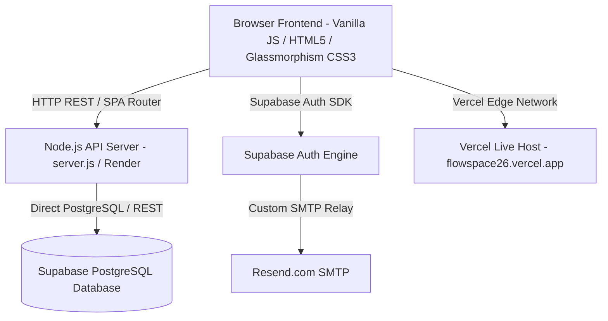

# System Architecture - Flowspace

## 1. High-Level Architecture Overview

---

## 2. Layered Component Architecture

### 2.1 Frontend Layer (`public/`)
- **`index.html`**: Single-Page Application HTML structure featuring:
  - Single-page views (`#overview`, `#board`, `#activity`, `#team`, `#account`).
  - Mobile Bottom Navigation Bar (`.mobile-bottom-nav`) for single-tap mobile navigation.
  - Notification popover modal & badges.
- **`styles.css`**: Complete design system with CSS custom properties (variables), Glassmorphism backdrop-filters, custom responsive media queries for Mobile (`< 768px`), Tablet (`769px - 1080px`), Laptop, and Desktop.
- **`app.js`**: Application logic layer:
  - State management (`refresh()`, `state` object).
  - Client-side SPA view routing (`setView()`).
  - Native HTML5 Drag-and-Drop Kanban engine with touch handling.
  - Form validation & Eye password toggles (`wirePasswordToggles()`).
  - Targeted Notifications Engine & Mark as Read handlers (`/api/notifications/read`, `/api/notifications/read-all`).

### 2.2 Backend API Layer (`server.js`)
- Native Node.js HTTP server.
- Handles authentication, workspace multi-tenancy, RBAC role validation (`getCallerRole()`), Project cascade deletion, Task CRUD, and Notification state updates.
- Dual-persistence driver: Writes to Supabase PostgreSQL DB when connected, falling back seamlessly to local `data.json`.

### 2.3 Database & Deployment Infrastructure
- **PostgreSQL Database**: Managed via Supabase (`schema.sql`).
- **Production Hosting**: Vercel (`flowspace26.vercel.app`) for frontend distribution and Render for Node.js backend.
- **Repository**: GitHub Repository (`Annu1901/Flowspace.git`).
