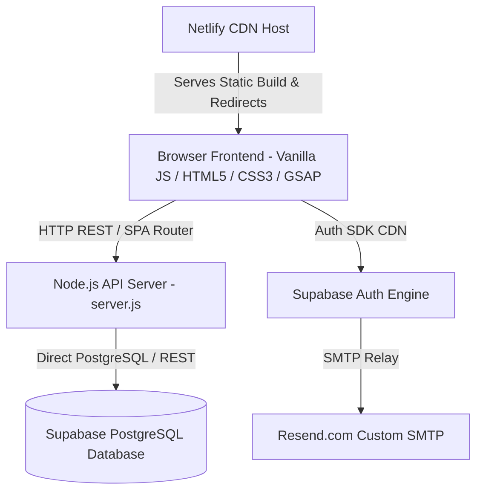

# System Architecture - Flowspace

## 1. High-Level Architecture Overview

---

## 2. Layered Component Architecture

### 2.1 Frontend Layer (`public/`)
- **`index.html`**: Single-Page Application HTML structure with modular views (`#overview`, `#board`, `#activity`, `#team`, `#account`), modal backdrops, and SVG icons.
- **`styles.css`**: Design tokens (variables for colors, typography, glassmorphism), CSS Grid & Flexbox, password input wrappers, toast notifications, animations.
- **`app.js`**: Core application logic:
  - State management (`refresh()`, `state` object).
  - Client-side SPA routing (`setView()`, hash change listeners).
  - Form validation & Eye toggle handlers (`wirePasswordToggles()`).
  - Supabase Auth helpers (`getSupabase()`, `resetPasswordForEmail()`, `updateUser()`).
  - One-time invitation modal logic with LocalStorage persistence (`checkPendingInvitePrompt()`).

### 2.2 Backend & API Layer (`server.js`)
- Light-weight native Node.js HTTP server.
- Handles authentication routing, password validation, workspace multi-tenancy isolation, RBAC role checks (`getCallerRole()`), and task CRUD operations.
- Direct integration with Supabase client (`@supabase/supabase-js`) for auth user management.

### 2.3 Database & Cloud Layer
- **PostgreSQL Database** managed via Supabase (`schema.sql`).
- **Resend.com SMTP** configured inside Supabase Authentication settings.
- **Netlify Cloud Hosting** configured with `netlify.toml` SPA rewrite rules (`/* -> /index.html`).
