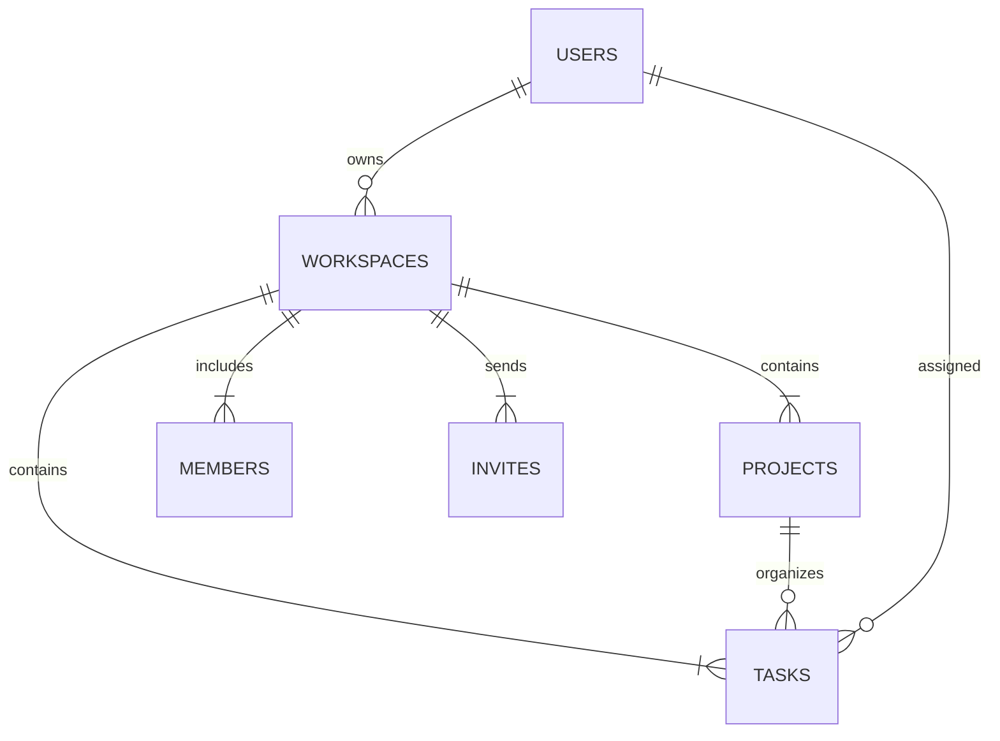

# Database Schema & Design - Flowspace

## 1. Relational Database ERD (Entity-Relationship Diagram)



---

## 2. PostgreSQL Schema Definition (`schema.sql`)

```sql
-- Enable UUID extension
CREATE EXTENSION IF NOT EXISTS "uuid-ossp";

-- 1. Users Table
CREATE TABLE IF NOT EXISTS users (
    id UUID PRIMARY KEY DEFAULT uuid_generate_v4(),
    email VARCHAR(255) UNIQUE NOT NULL,
    name VARCHAR(255) NOT NULL,
    password VARCHAR(255) NOT NULL,
    active_workspace_id UUID,
    created_at TIMESTAMP WITH TIME ZONE DEFAULT CURRENT_TIMESTAMP
);

-- 2. Workspaces Table
CREATE TABLE IF NOT EXISTS workspaces (
    id UUID PRIMARY KEY DEFAULT uuid_generate_v4(),
    name VARCHAR(255) NOT NULL,
    description TEXT,
    created_by UUID REFERENCES users(id) ON DELETE CASCADE,
    created_at TIMESTAMP WITH TIME ZONE DEFAULT CURRENT_TIMESTAMP
);

-- 3. Projects Table
CREATE TABLE IF NOT EXISTS projects (
    id UUID PRIMARY KEY DEFAULT uuid_generate_v4(),
    workspace_id UUID REFERENCES workspaces(id) ON DELETE CASCADE,
    name VARCHAR(255) NOT NULL,
    description TEXT,
    created_at TIMESTAMP WITH TIME ZONE DEFAULT CURRENT_TIMESTAMP,
    updated_at TIMESTAMP WITH TIME ZONE DEFAULT CURRENT_TIMESTAMP
);

-- 4. Members Table
CREATE TABLE IF NOT EXISTS members (
    id UUID PRIMARY KEY DEFAULT uuid_generate_v4(),
    workspace_id UUID REFERENCES workspaces(id) ON DELETE CASCADE,
    user_id UUID REFERENCES users(id) ON DELETE CASCADE,
    name VARCHAR(255) NOT NULL,
    email VARCHAR(255) NOT NULL,
    role VARCHAR(50) NOT NULL DEFAULT 'Workspace member',
    color VARCHAR(50) DEFAULT '#0ea5e9',
    created_at TIMESTAMP WITH TIME ZONE DEFAULT CURRENT_TIMESTAMP
);

-- 5. Tasks Table
CREATE TABLE IF NOT EXISTS tasks (
    id UUID PRIMARY KEY DEFAULT uuid_generate_v4(),
    workspace_id UUID REFERENCES workspaces(id) ON DELETE CASCADE,
    project_id UUID REFERENCES projects(id) ON DELETE SET NULL,
    title VARCHAR(255) NOT NULL,
    description TEXT,
    status VARCHAR(50) NOT NULL DEFAULT 'todo',
    priority VARCHAR(50) NOT NULL DEFAULT 'medium',
    assignee_id UUID REFERENCES members(id) ON DELETE SET NULL,
    due_date DATE,
    tags JSONB DEFAULT '[]'::jsonb,
    attachments JSONB DEFAULT '[]'::jsonb,
    comments JSONB DEFAULT '[]'::jsonb,
    created_at TIMESTAMP WITH TIME ZONE DEFAULT CURRENT_TIMESTAMP,
    updated_at TIMESTAMP WITH TIME ZONE DEFAULT CURRENT_TIMESTAMP
);

-- 6. Invites Table
CREATE TABLE IF NOT EXISTS invites (
    id UUID PRIMARY KEY DEFAULT uuid_generate_v4(),
    workspace_id UUID REFERENCES workspaces(id) ON DELETE CASCADE,
    workspace_name VARCHAR(255),
    email VARCHAR(255) NOT NULL,
    name VARCHAR(255),
    role VARCHAR(50) NOT NULL DEFAULT 'Workspace member',
    status VARCHAR(50) NOT NULL DEFAULT 'Pending',
    created_at TIMESTAMP WITH TIME ZONE DEFAULT CURRENT_TIMESTAMP
);
```

---

## 3. Database Security & Row-Level Security (RLS)
- Workspace Isolation: Queries are filtered by `workspace_id`.
- Unaccepted Membership Enforcement: Users with `Pending` or `Declined` invite statuses are purged from the active `members` table to prevent unauthorized workspace access.
